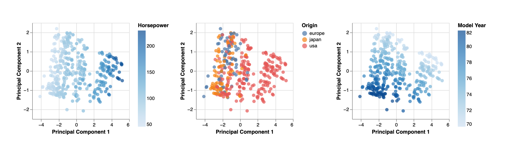

# Automobile EDA

Basic exploratory data analysis on a dataset of automobiles using PCA.

This project is an assignment for the Park Tudor data science class.
See [assignment.md](assignment.md) for the full written assignment.



## Usage

```bash
pip install -r requirements.txt
python main.py
```

## Data Source

This automobile dataset comes from Kaggle:
https://www.kaggle.com/datasets/tawfikelmetwally/automobile-dataset
